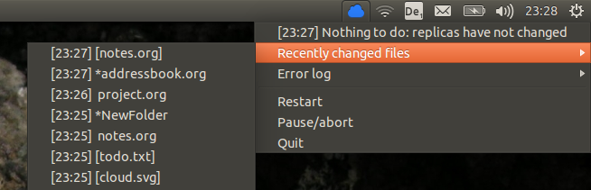

# Syndicator
Syndicator is a python script providing a "synchronization indicator" for the file synchronzation software [Unison](http://www.cis.upenn.edu/~bcpierce/unison/download/releases/stable/unison-manual.html) on Ubuntu, i.e. a dynamic icon in the Unity panel that indicates the current synchronization state.  It comes in two versions: 

name | language | tested on
-----|----------|-----------
syndicator2 | python 2 | Ubuntu 14.04 (Unity desktop)
syndicator 3 | python 3 | Ubuntu 18.04 (gnome desktop)


## Features
Each time you log in, Syndicator will run [Back In Time](http://backintime.le-web.org/) (or some other command that you can specify) once and then try to start [Unison](http://www.cis.upenn.edu/~bcpierce/unison/download/releases/stable/unison-manual.html).  If running Unison fails (for example because there is no connection to the server), Syndicator keeps trying at intervals of 1, 2, 4 .... 300 seconds.  The current status is displayed in the indicator panel as follows:

icon | status
-----|--------
   | creating backups
   | syncing
 | repositories are fully synchronized
 | error (will restart automatically in x seconds)

Additional information is provided via a menu: the current output of Back In Time/Unison, a list of recently synchronized files, and a list of errors.  



Clicking on the first menu entry brings up a window displaying the last few (rather than just the last one) line of output from Back In Time/Unison.

## Prerequisites (overview)
1.  Linux operating system on your client machine (tested only on Ubuntu 14.04 with Unity desktop)
2.  ssh access to a server, preferably via public key authentication
3.  a working installation of Unison on both client and server (version 2.48.3 or later)
4.  (optional) a working installation of Back In Time or some other command line backup tool

Brief details on how to set up 2-4 can be found [further below](#prerequisites-instructions).

## Installation/configuration

Download either the folder `syndicator2` or the folder `syndicator3`, depending on which version you want / which version of python is installed on your system.  (Unfortunately, `git` does not support downloading single folders, but if you have `svn` installed then according to [this answer on stackoverflow](https://stackoverflow.com/a/18194523/3611932) you can download each folder with
```
svn checkout https://github.com/TentativeConvert/Syndicator/trunk/syndicator2
svn checkout https://github.com/TentativeConvert/Syndicator/trunk/syndicator3
```
Or click [this link](https://minhaskamal.github.io/DownGit/#/home?url=https://github.com/TentativeConvert/Syndicator/tree/master/syndicator2).

Open `config.py`and adapt the following lines:
```
backup_command = "backintime --profile-id 2 -b"
sync_command = "unison XPS12-reh -repeat watch"
```
That is, replace the `2` in the first line with the id of the Back In Time profile that you would like Syndicator to use, and replace `XPS12-reh` by the name of the relevant Unison profile.  The Unison profile should include the following options:
```
batch = true
prefer = newer
copyonconflict = true
```
Alternatively, you can include these flags as command line arguments in the value of the `sync_command`, of course. 

Finally, make `main.py` executable (if necessary) with `chmod +x main.py`.
You should now be able to start Syndicator with one of the following commands:

syndicator2: call `python main.py` from within the folder syndicator2

syndicator3: call `python -m syndicator3.main` from the *parent folder* of the folder synicator3.

The icons used by Syndicator are essentially the UbuntuOne icons delivered with Ubuntu 14.04.  You can change these either by replacing the relevant files in the `icons` folder or by editing `config.py`.  For [at least some of the] icons in `/usr/share/icons/` you only need to supply the file name, not the full path.  

## Prerequisites (instructions)
### ssh access to server via public key authentication
Generate a public-private-keypair on your client with:
```
$ ssh-keygen -t rsa -b 4096
```
You will be promted for a passphrase.  Choose it carefully.  Empty passphrases work, but then whoever manages to hack into your computer will automatically gain access to your server.

There should now be one private key (`id_rsa`) and one public key (`id_rsa.pub`) in `~/.ssh`.
Copy the public key to the server:
```
$  scp .ssh/id_rsa.pub username@server.address:/user-directory/.ssh/otherkeys
```
Append this public key to the file `.ssh/authorized_keys` on the server:
```
$  ssh username@server.address
$  cd ~/.ssh
$  cat otherkeys/id_rsa.pub >> authorized_keys
```
If the server is correctly configured, future calls of `ssh username@server.address` should no longer ask for a password.  

### Unison
See http://www.cis.upenn.edu/~bcpierce/unison/download/releases/stable/unison-manual.html
for the official manual.  

Binaries for Unison 2.48.3 built for 64-bit versions of  Ubuntu 14.04  are included in the `unison-binaries` folder in this repository.  If you are running this version of Ubuntu on your client and server, you can simply copy these binaries to any folder in which the system would usually look for them, e.g. `usr/bin/` or `~/bin/`.  Then read the manual to find out how to configure your profile.

Unison is also available through the official Ubuntu channels and other distributions.  However, continuous synchronization of 'watched' folders only works with the very latest version of Unison (2.48).  So if the above binaries don't work for you,  you will most likely need to compile your own, for which you need an OCaml compiler.  

#### Build Unison locally:
- Install Ocaml from the software center (4.01.0-3ubuntu3).
- Download Unison from http://www.cis.upenn.edu/~bcpierce/unison/ and unpack, e.g. to `~/Downloads/unison-2.48.3`.
- Switch to this folder and run make:
``` 
$ cd ~/Downloads/unison-2.48.3
$ sudo make UISTYLE=text
```
  Test success with `$ ./unison` -- this should display a usage message.  
- Copy the binaries to `~/bin` or whereever you want them, and create a link so that you can start Unison simply by typing `unison` in the command line:
```
$ mkdir ~/bin
$ cp ~/Downloads/unison ~/bin/unison-2.48.3
$ cp ~/Downloads/unison-fsmonitor ~/bin/unison-fsmonitor
$ ln -s unison-2.48.3 unison
```
Calling `unison` should now display the same usage message as before.  

#### Build Unison on the server:    
This should work exactly as above.  *However, you need to make sure you have the same version of Unison on both client on server, and they should be compiled with the same version of OCaml.*  Unison 2.48 compiled with OCaml < 4.02 conflicts with Unison 2.48 compiled with OCaml 4.02!  If you're lucky and the server uses the same architecture as your client you can of course simply copy the binaries. 

If there are several versions of Unison on the server, you need to start Unison with the flag `--add-version-no`.  More precisely, starting `unison-2.48.3` on the client with `--add-version-no` will call `unison-2.48` (without subversion number) on the server, so in addition to setting this flag you will need to create a soft link `unison-2.48` on the server pointing to `unison-2.48.3`.

### Create a Unison profile:
For Unison to actually do anything, you will need to create a profile `myprofile.prf` in `~/.unison/` -- see the [manual](http://www.cis.upenn.edu/~bcpierce/unison/download/releases/stable/unison-manual.html).

### Back In Time
See http://backintime.le-web.org/
